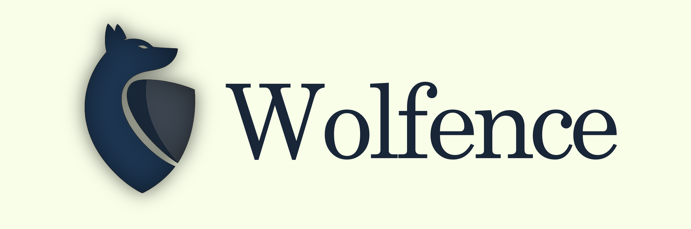

Wolfence is a **security-first Git interface** that prevents unsafe code
from ever leaving a developer's machine.

[](#)
[](#)


------------------------------------------------------------------------

Modern developers move fast --- sometimes too fast.

Sensitive data, insecure patterns, vulnerable dependencies, and
misconfigurations often slip into repositories unnoticed.

**Wolfence changes that.**

> Wolfence stands between your code and the world --- and decides if
> it's safe to pass.
> It does not try to replace your whole Git workflow.

You write code normally.\
You commit normally.\
Then `wolf push` decides whether the outbound code is safe enough to leave the
machine.

Before any code is pushed, Wolfence:

1.  Analyzes your changes\
2.  Runs deep security scans\
3.  Detects vulnerabilities\
4.  Blocks unsafe code\
5.  Explains issues\
6.  Allows safe code automatically

------------------------------------------------------------------------

## Core Concept

Traditional flow:

git push → code goes to repo → problems discovered later

Wolfence flow:

wolf push → scan → (block OR allow) → push

------------------------------------------------------------------------

## Protection Layers

### Secrets

API keys, tokens, private keys, .env leaks

### Vulnerabilities

SQLi, XSS, SSRF, injections, unsafe eval

### Dependencies

CVEs, outdated libs, malicious packages

### Config

Docker, CI/CD, Terraform, permissions

### Policies

Custom org rules

------------------------------------------------------------------------

## Features

-   Fast (scan only changed code)
-   Blocks unsafe pushes
-   Clear explanations
-   Git integration
-   Extensible engine

------------------------------------------------------------------------

## Architecture

CLI → Orchestrator → Scanners → Policy → Decision → Git

------------------------------------------------------------------------

## Implementation Direction

Wolfence is now being implemented in **Rust** as a **local-first modular
monolith**.

Why:

- one trusted binary
- deterministic local enforcement
- strong performance for scans
- good fit for a security-sensitive developer tool

Core docs:

- `docs/architecture/overview.md`
- `docs/architecture/decision-records/0001-modular-monolith.md`
- `docs/security/threat-model.md`
- `docs/security/detection-model.md`
- `docs/security/policy-model.md`
- `docs/security/override-receipts.md`
- `docs/security/receipt-approval-policy.md`
- `docs/security/live-advisories.md`
- `docs/security/audit-chain.md`
- `docs/security/trust-store.md`
- `docs/development/audit.md`
- `docs/development/doctor.md`
- `docs/development/prototype-demo.md`
- `docs/repo-map.md`

------------------------------------------------------------------------

## Commands

wolf init\
wolf push\
wolf scan\
wolf scan push\
wolf doctor\
wolf config\
wolf audit list\
wolf audit verify\
wolf trust list\
wolf trust verify <key-id>\
wolf trust init <key-id> <owner> <expires-on> [categories]\
wolf trust archive <key-id> <reason>\
wolf trust restore <key-id>\
wolf receipt list\
wolf receipt new <receipt-path> <action> <category> <fingerprint> <owner> <expires-on> <reason>\
wolf receipt checksum <receipt-path>\
wolf receipt verify <receipt-path>\
wolf receipt archive <receipt-path> <reason>\
wolf receipt sign <receipt-path> <approver> <key-id> <private-key-path>

------------------------------------------------------------------------

## 📦 Install

Build and install the local binary:

```bash
cargo install --path . --force
```

Then the tool is available directly as:

```bash
wolf push
```

During development, `cargo run -- push` still works, but the intended product
surface is `wolf ...`.

------------------------------------------------------------------------

## 🧪 Modes

Advisory / Standard / Strict

------------------------------------------------------------------------

## Configuration

Wolfence now uses a repo-local config file at:

` .wolfence/config.toml `

Current precedence:

1. `WOLFENCE_MODE`
2. repo config
3. built-in default (`standard`)

Initialize it with:

`cargo run -- init`

Inspect the resolved config with:

`cargo run -- config`

Try the current local prototype end to end with:

`docs/development/prototype-demo.md`

------------------------------------------------------------------------

## MVP

-   wolf push
-   secret scanning
-   basic SAST
-   dependency scan
-   git hooks

Current `wolf push` behavior:

- scans the outbound push candidate set, not just staged files
- if an upstream exists, compares `upstream..HEAD`
- if no upstream exists yet, treats the current `HEAD` snapshot as the initial push payload
- only runs `git push` after policy evaluation allows the action
- initial protected pushes prefer `origin`, then fall back to the first configured remote
- use `WOLFENCE_DRY_RUN=1` to test the decision path without executing the final push
- `wolf init` installs a managed `pre-push` hook for native `git push`
- `wolf doctor` audits whether local enforcement is actually trustworthy
- repo-local override receipts can suppress specific findings only when they are explicit, unexpired, and integrity-valid
- protected push decisions are written to a chained local audit log under `.wolfence/audit/`
- the audit log now distinguishes policy allowance from real `git push` completion and records push transport failures explicitly

Current detection strengths:

- layered secret detection for sensitive file paths, private keys, known token families, and high-entropy secret assignments
- dependency intelligence for direct Git/URL sources, insecure transport, wildcard versions, lockfile integrity posture, and manifest/lockfile drift
- optional OSV-backed live advisory checks for exact dependency versions during protected pushes

Current policy strengths:

- deterministic sorting and deduplication of findings before policy evaluation
- severity, confidence, and category-aware decisions instead of severity alone
- stronger standard-mode blocking for medium high-confidence non-vulnerability findings
- strict-mode blocking for low high-confidence non-vulnerability findings that still weaken provenance or policy posture
- rich blocked-push explanations with location, remediation, and policy rationale
- reviewable override receipts with owner, reason, expiry, and integrity checks
- repo-local trust material that upgrades receipts from checksum-only to signed exceptions
- category-scoped trust keys so one signer does not automatically gain approval power across every receipt type
- archived trust keys so signer retirement removes live trust influence without deleting reviewable evidence
- `trust verify` now distinguishes live keys from archived keys instead of treating retired trust material as absent
- `trust restore` can recover the latest archived signer back into live trust while recording the restoration in archive history
- first-class receipt creation, checksum, and signing commands so exception material is generated canonically
- receipt ids and reviewer metadata so exception ownership is visible in the CLI
- repo-local receipt approval policy with reviewer/approver allowlists and lifetime bounds
- explicit live advisory modes: `off`, `auto`, and `require`
- tamper-evident local audit entries for protected push decisions

------------------------------------------------------------------------

## Roadmap

-   Cloud dashboard\
-   AI analysis\
-   VSCode extension\
-   GitHub integration

------------------------------------------------------------------------

## Philosophy

Every push must survive the wolf.

------------------------------------------------------------------------

## 📜 License

MIT
`wolf scan` previews the staged set under current policy, and `wolf scan push`
previews the real outbound push scope. Both return a failing exit code when the
current policy would block, without invoking `git push`.
